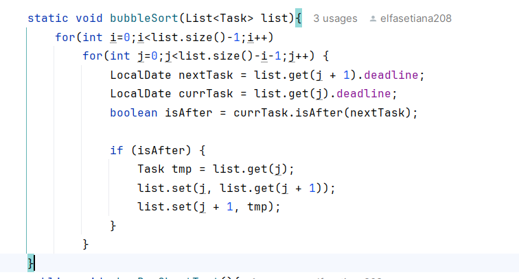
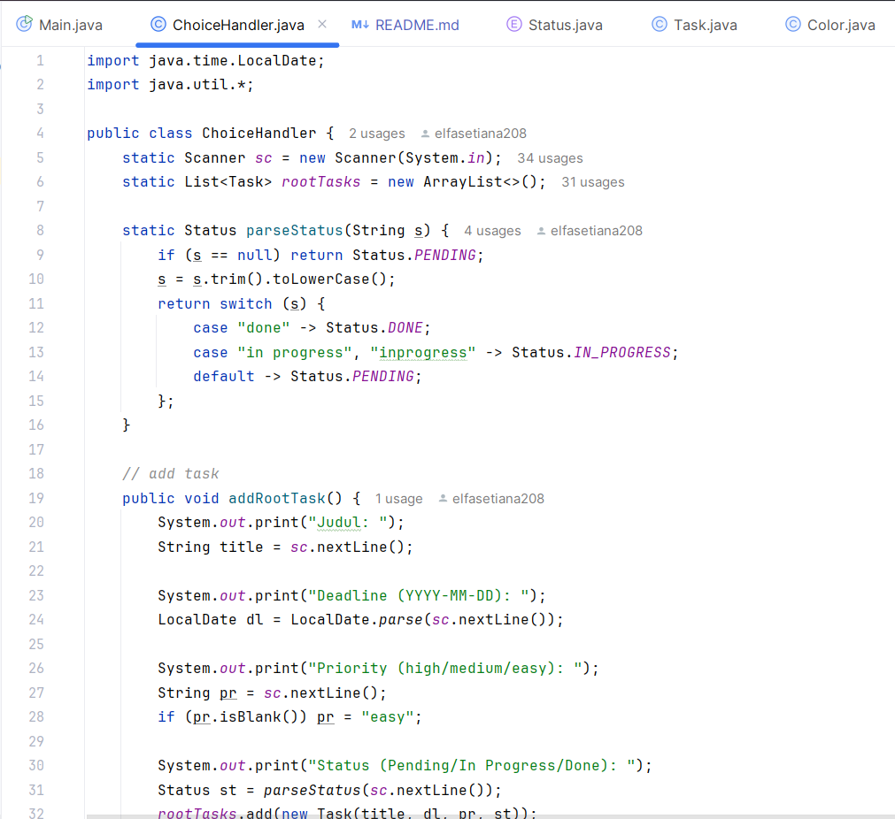
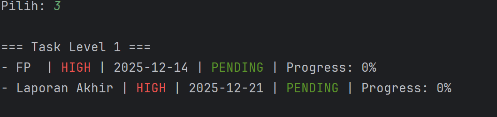
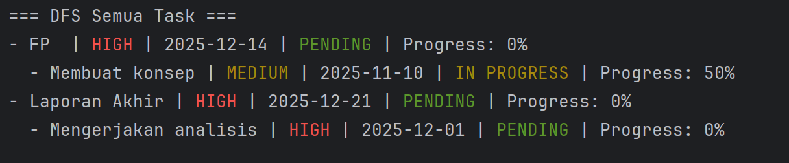
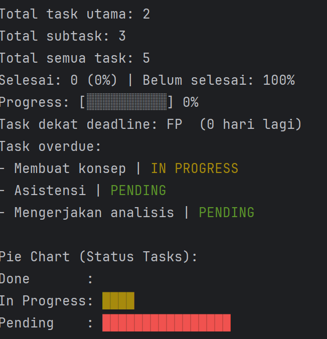

## Final Project ASD (Algoritma Struktur Data) Semester Gasal 2025/2026: TO-DO LIST (TASK MANAGEMENT)

## Informasi Poject
Dosen Pengampu: Renny Pradina Kusumawardani

Kelas: D

Kelompok: 6

| No | Nama                | NRP     |
| -- | ------------------- | ------- |
| 1  | Anggraita Prabawati | 5026241103 |
| 2  | Widda Farrah Kayla  | 5026241119 |
| 3  | Milawati            | 5026241163 |
| 4  | Elfa Setiana        | 5026241208 |

## Latar Belakang
Dalam aktivitas akademik maupun sehari-hari, pengelolaan tugas yang terstruktur menjadi kebutuhan penting agar berbagai pekerjaan dapat diselesaikan secara efektif dan tepat waktu. Sering kali satu tugas utama memiliki beberapa subtask dengan tingkat prioritas dan batas waktu yang berbeda, sehingga diperlukan sistem yang mampu mengorganisasi tugas secara jelas dan sistematis.
Berdasarkan permasalahan tersebut, kami membuat sebuah sistem yaitu To-Do List berbasis Algoritma dan Struktur Data sebagai implementasi konsep yang dipelajari dalam mata kuliah Algoritma dan Struktur Data. Sistem pencatatan tugas yang membantu pengguna mengelola task dan subtask, menentukan prioritas berdasarkan tingkatan level, serta menampilkan deadline terdekat. Dengan penerapan struktur data dan algoritma seperti Tree, List, Depth First Search (DFS), dan Bubble Sort. Sistem ini mampu menampilkan hubungan hierarki tugas secara jelas, menyusun prioritas secara sistematis, serta menampilkan tugas berdasarkan deadline terdekat sehingga pengelolaan tugas dapat dilakukan secara lebih optimal dan terencana.

## Solusi yang Ditawarkan
Solusi yang ditawarkan adalah sebuah sistem To-Do List yang dirancang dengan menerapkan konsep Algoritma dan Struktur Data. Program ini menggunakan struktur data Tree untuk menampilkan hubungan antara task dan subtask secara terstruktur, sehingga pengguna dapat memahami hierarki tugas dengan lebih jelas. Selain itu, algoritma Depth First Search (DFS) diterapkan untuk menampilkan detail task dan subtask secara menyeluruh, sedangkan algoritma Bubble Sorting digunakan untuk mengurutkan task berdasarkan deadline terdekat. Melalui penerapan solusi tersebut, pengguna dapat lebih mudah menentukan prioritas serta mengelola tugas secara efektif dan terencana.

## Fitur Program
Dalam mendukung pengelolaan tugas secara sistematis dalam sistem To-Do List, terdapat 8 fitur utama sebagai berikut:

1. Tambah Task Utama: Fitur ini memungkinkan pengguna untuk menambahkan task utama sebagai root dalam struktur data. Task utama menjadi dasar pembentukan hierarki tugas dalam sistem.

2. Tambah Subtask: Pengguna dapat menambahkan subtask ke dalam task utama yang sudah ada. Fitur ini mendukung pembentukan hubungan hierarkis antara task dan subtask menggunakan struktur data Tree.

3. Tampilkan Task Level 1: Fitur ini digunakan untuk menampilkan task utama (level pertama) tanpa menampilkan detail subtask, sehingga pengguna dapat melihat gambaran umum daftar tugas.

4. Tampilkan Semua Task: Fitur ini menampilkan seluruh task dan subtask secara menyeluruh menggunakan algoritma Depth First Search (DFS), sehingga struktur tugas dapat ditelusuri hingga ke level terdalam.

5. Edit Task/Subtask: Sistem menyediakan fitur untuk mengubah data task atau subtask yang telah dibuat, seperti nama atau informasi lain yang terkait dengan tugas tersebut.

6. Hapus Task/Subtask: Fitur ini memungkinkan pengguna menghapus task maupun subtask yang tidak lagi diperlukan dari sistem.

7. Statistik: Fitur statistik menampilkan ringkasan progres to-do list, termasuk informasi jumlah task yang telah selesai dan belum selesai, serta visualisasi sederhana berupa bar chart dalam bentuk teks.

8. Keluar dari Sistem: Fitur ini digunakan untuk mengakhiri proses dan keluar dari sistem To-Do List.

## Algoritma dan Struktur Data yang Digunakan
1. Algoritma

Bubble Sort (Deadline): Mengurutkan task dan subtask berdasarkan deadline terdekat. Pada program ini, algoritma Bubble Sort diterapkan agar task dengan batas waktu paling mendesak ditampilkan lebih awal, sehingga membantu pengguna dalam menentukan prioritas penyelesaian tugas.

DFS (Menampilkan semua task): Menampilkan seluruh struktur task beserta subtask secara mendalam. DFS memungkinkan sistem menelusuri setiap task hingga ke level terdalam, sehingga pengguna dapat melihat detail dari setiap task dan subtask yang dimiliki.

2. Struktur Data

Tree (ToDoList.Task & Subtask): Menyusun data tugas dalam bentuk hubungan bertingkat, di mana setiap task dapat memiliki subtask. Pengelompokan tugas secara terstruktur serta mendukung proses penelusuran data menggunakan algoritma DFS secara efisien.

List: Sistem To-Do List menggunakan struktur data List dengan implementasi ArrayList untuk menyimpan subtask. Struktur ini bersifat dinamis, berurutan, dan memudahkan proses traversal menggunakan algoritma DFS secara rekursif.

## Bukti Tampilan Program (Code)

Hasil perubahan code Bubble Sort pada Class CoiceHandler.java

Tampilan jumlah Class pada code

Output tampilan Menu

Output tampilan Task Utama

Output tampilan Task Keseluruhan

Output tampilan Statistik

## Riwayat Update Program
Berikut adalah riwayat update yang kami lakukan. Seluruh riwayat update di bawah ini tidak memiliki perubahan tampilan pada output yang dihasilkan

Update 10/12/2025
1. Mengubah implementasi BFS menjadi menggunakan struktur data Queue (sekarang tidak menggunakan BFS)
2. Mengubah implementasi DFS menjadi menggunakan struktur data Stack (sekarang diubah menjadi DFS rekursif)

Update 11/12/2025
1. DFS menggunakan stack diubah menjadi penggunaan DFS rekursif
2. Untuk menampilkan task utama ternyata tidak perlu menggunakan BFS. Oleh karena itu, proyek kami pada akhirnya tidak menggunakan algoritma BFS
   
Update 12/12/2025
1. Class CoiceHandler dibuat untuk memisahkan code method setiap menu dari Class ToDoList.Main
2. Perbaikan code Bubble Sort
